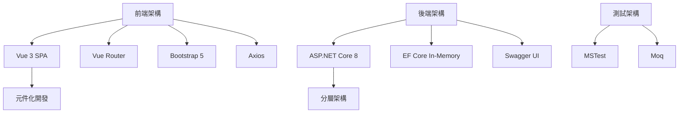

# 訂閱服務追蹤系統


## 系統設計目標
整合 ASP.NET Core 後端與 Vue 3 前端，實現以下核心功能：
- 訂閱服務全週期管理 (CRUD)
- 日曆視覺化與費用預警
- 多維度報表分析
- 自動化剩餘天數計算
- 即時總費用統計

## 架構決策


## 功能規格
### 核心功能
- 訂閱服務管理
  - 新增/編輯/刪除訂閱項目
  - 日曆視圖顯示繳費日期
  - 自動計算剩餘天數
- 報表系統
  - 總費用統計
  - 類別篩選
  - 排序功能 (名稱/費用/剩餘天數)

## 主要功能
- 🗓️ 訂閱服務日曆視圖
- 📊 費用報表與統計分析
- 🔍 依類別篩選與排序
- 📈 剩餘天數計算
- ✅ 單元測試覆蓋核心邏輯

## 技術架構
### 後端
- ASP.NET Core 8 Web API
- Entity Framework Core 8
- In-Memory 資料庫
- Swagger UI 文件
- xUnit 單元測試

### 前端
- Vue 3 組合式API
- Vue Router 4
- Bootstrap 5 響應式設計
- FontAwesome 圖標
- Axios HTTP 客戶端

## 快速開始
### 必要環境
- .NET 8 SDK
- Node.js 18+
- npm 9+

### 安裝步驟
```bash
# 克隆儲存庫
git clone https://github.com/your-repo/subscription-tracker.git

# 安裝後端依賴
cd SubscriptionTracker.Api
dotnet restore

# 安裝前端依賴
cd ../subscription-tracker-client
npm install
```

### 執行指令
```bash
# 啟動後端 (Port 5000)
dotnet run --project SubscriptionTracker.Api

# 啟動前端 (Port 8080)
cd subscription-tracker-client
npm run serve

# 或使用整合腳本 (PowerShell)
./run-all.ps1
```

## 專案結構
```
subscription-tracker/
├── SubscriptionTracker.Api/      # 後端API
├── subscription-tracker-client/  # 前端SPA
├── SubscriptionTracker.Service/  # 領域層
├── SubscriptionTracker.Tests/    # 單元測試
└── run-all.ps1                   # 一鍵啟動腳本
```

## 測試執行
```bash
# 執行後端單元測試
dotnet test SubscriptionTracker.Tests
```

## 持續整合 (CI/CD)
本專案使用 GitHub Actions 進行持續整合，確保程式碼品質與自動化測試：

- **後端 CI**: 自動建置 .NET 專案並執行單元測試
- **前端 CI**: 自動建置 Vue.js 專案並執行程式碼檢查
- **合併 CI**: 同時執行前後端的建置與測試流程

詳細配置請參閱 [.github/workflows](.github/workflows) 目錄。

## 授權條款
MIT License - 詳見 [LICENSE](LICENSE) 文件
